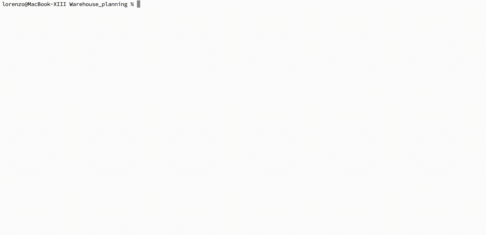

# Warehouse_planning

This project is aimed to compare the performances of the Answer Set Programming and MiniZinc languages.
The planning problem used for the comparison is a warehouse planning problem, where we need to move boxes out of a warehouse. 📦

### Constraints

The boxes can only be moved, and not pushed (in a similar fashion to the "Sokoban" game); the worker's movement is not taken into account.  
Multiple aligned boxes can all be pushed with a single move. ➡️📦📦  
The warehouse also contains drawers that act as obstacles (they cannot be moved). 🚫

### Goal

The goal is to push all boxes out of a door, trying to find the plan with the minimum number of moves.

Project realized for the Automated Reasoning course for the M.S. degree "Artificial Intelligence & Cybersecurity" @ University of Udine, 2023

## Usage

### Instance generation and visualization

Intances can be randomically generated using the `generate_instances.py` script. A certain degree of difficulty can be chosen passing `easy`, `medium` or `hard` to the script:

```
    generate_instances.py (easy|medium|hard) filename [-p path]
```

Instances can also be hand generated, but **there must be no overlappings between boxes or drawers**, otherwise the ASP and MiniZinc programs won't work correctly.

Instance examples to use as syntax reference:

- ASP (.lp file):
```
    #const m=6.
    #const n=5.
    #const maxtime=10.
    box(1,1,2).
    box(2,5,4).
    box(3,4,1).
    drawer(2,3).
```
- MiniZinc (.dzn file):
```
    m=6;
    n=5;
    maxtime=10;
    boxNumber = 3;
    drawerNumber = 1;
    constraint boxes[1, 0, 0] = 1 /\ boxes[1, 0, 1] = 2;
    constraint boxes[2, 0, 0] = 5 /\ boxes[2, 0, 1] = 4;
    constraint boxes[3, 0, 0] = 4 /\ boxes[3, 0, 1] = 1;
    drawers = array2d(1..drawerNumber, 0..1, [|2,3|]);
```
- JSON:
```
    {
        "m": 6, 
        "n": 5, 
        "maxtime": 10, 
        "boxes": [[1, 2], [5, 4], [4, 1]], 
        "drawers": [[2, 3]]
    }
```

JSON instance files can be visualized using the `visualize_instance.py`. This is useful to have a more concrete picture of the instance.

||
|:--:|


### Running the ASP model

To run the ASP model, simply run `warehouse.lp` with [clingo](https://potassco.org/clingo/) on your CLI, specifying the path to the instance file:
```
clingo warehouse.lp path/to/instance.lp
```



As usual for `clingo`, other parameters can be included to change and improve the search strategy.

### Running the MiniZinc model

The [MiniZinc](https://www.minizinc.org) model (`warehouse.mzn`) can be run using the CLI or the MiniZinc IDE:

- In the CLI, simply run MiniZinc specifying the path to the instance data:
```
    minizinc --solver <solver_id> warehouse.mzn path/to/instance.dzn
```
- In the IDE, you must instead include the data file, adding the following line at the top of `warehouse.mzn`:
```
    include "path/to/instance.dzn";
```
You can then run with the selected solver.

